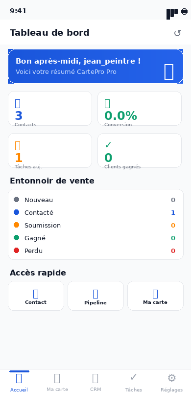
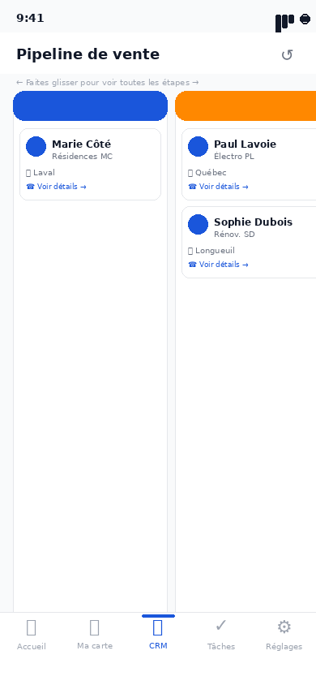
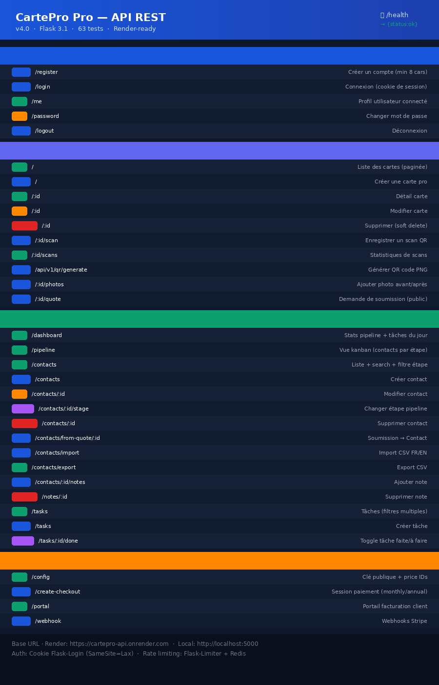

# 📇 CartePro Pro

**CartePro Pro** est la carte de visite numérique intelligente pour les **entrepreneurs en services manuels du Québec** — peintres, électriciens, plombiers, charpentiers, paysagistes, rénovateurs.

Backend Flask · CRM complet · QR Code · Stripe · Application mobile Flutter

---

## 📸 Captures

### Application mobile (Flutter)

| Connexion | Tableau de bord | Carte numérique |
|:---------:|:---------------:|:---------------:|
|  |  |  |

| Contacts CRM | Pipeline Kanban | Tâches |
|:------------:|:---------------:|:------:|
|  |  |  |

| Réglages & Stripe | API Endpoints |
|:-----------------:|:-------------:|
|  |  |

### Démo animée


---

## 🚀 Fonctionnalités

| Module | Fonctionnalités |
|--------|-----------------|
| 🔐 **Auth** | Inscription, connexion, profil, avatar, changement de mot de passe |
| 💳 **Carte numérique** | CRUD, QR code, photos avant/après, demandes de soumission |
| 📊 **CRM complet** | Contacts, pipeline kanban, notes, tâches, import/export CSV |
| 💰 **Stripe** | Abonnement 15$/mois ou 120$/an, portail de facturation, webhooks |
| 📱 **Mobile Flutter** | 10 écrans, navigation 5 onglets, thème Material 3 |
| 🔒 **Sécurité** | Rate limiting, headers sécurité, CORS, migrations Alembic |
| ✅ **Tests** | 63 tests pytest · CI GitHub Actions (lint, bandit, pip-audit) |

---

## 📁 Structure du projet

```
CartePro-backend/
├── app/
│   ├── __init__.py          # App factory, blueprints, extensions
│   ├── models.py            # User, Card, Contact, Task, Photo, etc.
│   ├── auth.py              # Routes auth (/auth/*)
│   ├── routes/
│   │   ├── cards.py         # /api/v1/cards — CRUD + scans + photos
│   │   ├── crm.py           # /api/v1/crm — contacts, pipeline, tâches
│   │   ├── stripe.py        # /api/v1/stripe — abonnements
│   │   ├── qr.py            # /api/v1/qr — génération QR code
│   │   └── public.py        # /view/<id> — page publique de carte
│   ├── storage.py           # Abstraction S3/Cloudflare R2 ou local
│   ├── services.py          # Email SendGrid, QR, utilitaires
│   ├── extensions.py        # db, migrate, login_manager, limiter
│   └── admin.py             # Flask-Admin
│
├── mobile/                  # Application Flutter
│   ├── lib/
│   │   ├── screens/         # 10 écrans (auth, dashboard, carte, CRM, réglages)
│   │   ├── models/          # CardModel, Contact, Task
│   │   ├── services/        # ApiService (Dio + cookie session)
│   │   └── theme/           # AppTheme Material 3
│   └── pubspec.yaml
│
├── migrations/              # Alembic (Flask-Migrate)
├── tests/                   # 63 tests pytest
├── docs/
│   ├── api_collection.json  # Collection Postman importable
│   └── DEPLOIEMENT_ET_TESTS.md
├── screenshots/             # Mockups et GIF de démo
├── render.yaml              # Déploiement Render (web + postgres + redis)
├── docker-compose.yml       # Dev local (PostgreSQL 15 + Redis 7)
└── .env.example             # Toutes les variables d'environnement
```

---

## 🛠️ Installation locale

```bash
# Backend Flask
git clone https://github.com/CMGeorges-cie/CartePro-backend
cd CartePro-backend
pip install -r requirements.txt
cp .env.example .env        # Remplir les clés Stripe, SendGrid, etc.

flask db upgrade            # Créer les tables (Alembic)
FLASK_APP=manage.py ADMIN_USERNAME=admin ADMIN_EMAIL=admin@cartepro.ca \
  ADMIN_PASSWORD=VotreMotDePasse flask seed-admin
flask run
```

```bash
# Mobile Flutter
cd mobile
flutter pub get
# Éditer lib/config/api_config.dart → mettre votre URL backend
flutter run
```

### Docker (backend complet)

```bash
docker-compose up --build
# PostgreSQL 15 + Redis 7 + Flask démarrent automatiquement
```

---

## 🔑 Variables d'environnement clés

```env
SECRET_KEY=<chaîne aléatoire>
DATABASE_URL=postgresql+psycopg2://cartepro:cartepro@db:5432/cartepro
STRIPE_SECRET_KEY=sk_live_...
STRIPE_PUBLIC_KEY=pk_live_...
STRIPE_WEBHOOK_SECRET=whsec_...
STRIPE_MONTHLY_PRICE_ID=price_1TdFjaGcAveCBBuL7PqcEY0j   # 15 $ CAD/mois
STRIPE_ANNUAL_PRICE_ID=price_1TdFjaGcAveCBBuLuH4Kn0Yz    # 120 $ CAD/an
SENDGRID_API_KEY=SG....
APP_URL=https://cartepro-api.onrender.com
```

Voir `.env.example` pour la liste complète.

---

## ✅ API — Endpoints principaux

| Méthode | Endpoint | Description |
|---------|----------|-------------|
| `POST` | `/auth/register` | Créer un compte |
| `POST` | `/auth/login` | Connexion (cookie session) |
| `GET` | `/auth/me` | Profil connecté |
| `POST` | `/api/v1/cards/` | Créer une carte numérique |
| `GET` | `/view/<id>` | Page publique de la carte (QR code) |
| `POST` | `/api/v1/qr/generate` | Générer QR code PNG |
| `GET` | `/api/v1/crm/dashboard` | Stats pipeline + tâches du jour |
| `GET` | `/api/v1/crm/pipeline` | Vue kanban (contacts par étape) |
| `POST` | `/api/v1/crm/contacts` | Créer un contact |
| `PATCH` | `/api/v1/crm/contacts/:id/stage` | Déplacer dans le pipeline |
| `POST` | `/api/v1/crm/contacts/import` | Import CSV FR/EN |
| `GET` | `/api/v1/crm/contacts/export` | Export CSV |
| `POST` | `/api/v1/crm/tasks` | Créer une tâche |
| `PATCH` | `/api/v1/crm/tasks/:id/done` | Toggle tâche faite/à faire |
| `POST` | `/api/v1/stripe/create-checkout` | Démarrer abonnement Stripe |
| `GET` | `/health` | Health check |

> 📄 Collection Postman complète (35 endpoints) : `docs/api_collection.json`

---

## 🧪 Tests

```bash
python3 -m pytest tests/ -v
# 63 passed — auth, api, CRM, pro features, admin
```

---

## 🚀 Déploiement Render

1. Render Dashboard → **New Blueprint** → sélectionner ce repo
2. `render.yaml` configure automatiquement le web service, PostgreSQL et Redis
3. Renseigner les 5 variables Stripe/SendGrid dans le dashboard Render
4. Depuis le Render Shell :
   ```bash
   flask db upgrade
   FLASK_APP=manage.py ADMIN_PASSWORD=xxx flask seed-admin
   ```

> Guide complet : `docs/DEPLOIEMENT_ET_TESTS.md`

---

## 📚 Licence

MIT License
